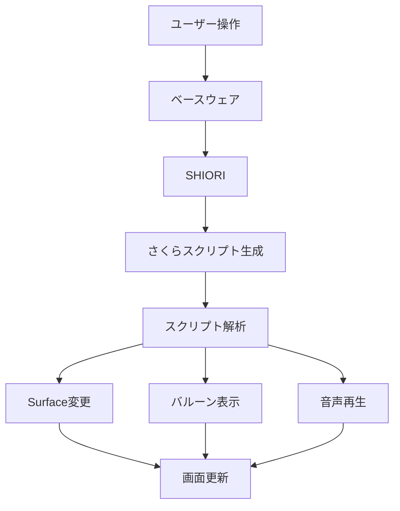

# 伺か（うかがか）ゴーストシステム仕様書

## 1. 概要

伺かは、デスクトップ上にキャラクター（ゴースト）を表示し、ユーザーとの対話を行うアプリケーションシステムです。

### 1.1 基本構成要素

```
ゴースト
├── ゴースト本体（AI・会話ロジック）
│   ├── SHIORI（会話エンジン）
│   ├── descript.txt（設定ファイル）
│   └── 会話データファイル群
├── シェル（外見・表示）
│   ├── Surface画像群（表情・ポーズ）
│   ├── descript.txt（設定ファイル）
│   └── surfaces.txt（アニメーション定義）
└── バルーン（吹き出し）
    ├── 吹き出し画像
    ├── descript.txt（設定ファイル）
    └── balloons.txt（テキスト配置定義）
```

### 1.2 動作フロー



## 2. ファイル構造

### 2.1 標準ディレクトリ構造

```
ゴースト名/
├── ghost/
│   └── master/
│       ├── descript.txt           # ゴースト基本設定
│       ├── shiori.dll            # 会話エンジン（DLL）
│       ├── *.txt                 # 会話データファイル
│       └── *.dic                 # 辞書ファイル
├── shell/
│   ├── master/                   # デフォルトシェル
│   │   ├── descript.txt          # シェル設定
│   │   ├── surface*.png          # Surface画像
│   │   └── surfaces.txt          # アニメーション定義
│   └── 他のシェル名/
└── balloon/
    └── バルーン名/
        ├── descript.txt
        ├── balloons*.png
        └── balloons.txt
```

### 2.2 ファイル命名規則

- **Surface画像**: `surface{数字}.png` (例: surface0.png, surface10.png)
- **会話ファイル**: 自由（通常は *.txt）
- **設定ファイル**: `descript.txt` (固定)

## 3. Surface（サーフェス）システム

### 3.1 Surface番号の基本ルール

```
0番台 (0-9):     メインキャラクター基本表情
10番台 (10-19):  相方キャラクター基本表情
100番台以上:     特殊表情・ポーズ
900番台以上:     システム用（設定画面など）
```

### 3.2 Surface画像仕様

- **フォーマット**: PNG形式
- **透過色**: `#00FF00` (明緑) または透明PNG
- **サイズ**: 自由（通常 200x300px程度）
- **色深度**: 24bit/32bit推奨

### 3.3 Surface切り替えパターン

```javascript
// 基本的な切り替えパターン
const surfacePatterns = {
  // メインキャラクター
  normal: 0,        // 通常
  happy: 1,         // 喜び
  sad: 2,           // 悲しみ
  angry: 3,         // 怒り
  surprised: 4,     // 驚き
  
  // 相方キャラクター
  partnerNormal: 10,
  partnerHappy: 11,
  
  // 特殊
  sleeping: 100,    // 睡眠
  eating: 200,      // 食事
  working: 300,     // 作業中
}
```

## 4. さくらスクリプト

### 4.1 基本タグ

さくらスクリプトは `\` で始まるタグで制御されます。

```
\0          メインキャラクターに切り替え
\1          相方キャラクターに切り替え
\s[番号]    Surface変更 (例: \s[1] = surface1に変更)
\e          会話終了
\n          改行
\w1-9       ウェイト（待機時間）
\c          吹き出しクリア
\![*]       特殊命令
```

### 4.2 実際の使用例

```
\0\s[0]おはよう。\w5\s[1]今日も良い天気だね。\e

\1\s[10]そうですね。\w3\s[11]お散歩でもしましょうか？\e

\0\s[4]\1\s[14]それは\w5いいアイデアだ！\e
```

### 4.3 高度なタグ

```
\![raise,OnSecondChange]     イベント発生
\![set,autotalk,300]         自動トーク間隔設定
\![sound,filename.wav]       音声再生
\![move,100,200]             ウィンドウ移動
```

## 5. SHIORI（AI・会話エンジン）

### 5.1 SHIORIの役割

- ユーザー入力の解析
- 適切な応答の生成
- ゴーストの状態管理
- イベント処理

### 5.2 主なSHIORIエンジン

```
KAWARI:     辞書ベース、初心者向け
YAYA:       スクリプト言語、高機能
MISAKA:     C++、高速処理
AYA:        古典的、多機能
```

### 5.3 SHIORI通信プロトコル

```http
GET SHIORI/3.0
Charset: UTF-8
ID: OnBoot
Reference0: 起動理由

応答:
SHIORI/3.0 200 OK
Charset: UTF-8
Value: \0\s[0]おはよう！今日も頑張ろう！\e
```

### 5.4 主要イベント

```javascript
const events = {
  OnBoot: "起動時",
  OnClose: "終了時", 
  OnSecondChange: "毎秒",
  OnMinuteChange: "毎分",
  OnMouseClick: "クリック時",
  OnMouseDoubleClick: "ダブルクリック時",
  OnKeyPress: "キー入力時",
  OnTalk: "会話開始時",
  OnUserInput: "ユーザー入力時",
  OnSystemLoad: "システム読み込み時"
}
```

## 6. バルーン（吹き出し）

### 6.1 バルーンの構成

```
balloon/バルーン名/
├── descript.txt              # 基本設定
├── balloons0.png            # 通常の吹き出し
├── balloons1.png            # 相方用吹き出し
├── online0.png              # オンライン表示
├── arrow0.png               # 矢印部分
└── balloons.txt             # テキスト配置定義
```

### 6.2 balloons.txtの書式

```
# 吹き出し0番の設定
balloon0.collision0,5,5,100,80
balloon0.alignment,left
balloon0.font.color.r,0
balloon0.font.color.g,0  
balloon0.font.color.b,0
balloon0.font.height,16
```

## 7. アニメーション

### 7.1 surfaces.txtでのアニメーション定義

```
# Surface0のアニメーション
surface0.animation0.interval,random,4
surface0.animation0.pattern0,overlay,101,0,0,0
surface0.animation0.pattern1,overlay,-1,0,0,0

# まばたきアニメーション
surface0.animation1.interval,sometimes
surface0.animation1.pattern0,overlay,102,0,0,0
surface0.animation1.pattern1,overlay,-1,0,0,0
```

### 7.2 アニメーションタイプ

- **overlay**: 重ね合わせ
- **replace**: 置き換え
- **interpolate**: 補間
- **bind**: 連動

## 8. 設定ファイル詳細

### 8.1 ghost/master/descript.txt

```ini
charset,UTF-8
type,ghost
name,ゴースト名
craftman,作者名
id,unique_ghost_id

sakura.name,メインキャラ名
kero.name,相方キャラ名

shiori,shiori.dll
```

### 8.2 shell/master/descript.txt

```ini
charset,UTF-8
type,shell
name,シェル名
craftman,作者名

sakura.balloon.offsetx,20
sakura.balloon.offsety,50
kero.balloon.offsetx,10
kero.balloon.offsety,20
```

## 9. イベント処理とタイミング

### 9.1 定期イベント

```javascript
// 自動実行されるイベント
const automaticEvents = {
  boot: "起動直後（1回）",
  secondchange: "毎秒",
  minutechange: "毎分", 
  hourchange: "毎時",
  
  // ランダムトーク
  talk: "指定間隔でランダム実行"
}
```

### 9.2 ユーザーイベント

```javascript
// ユーザー操作によるイベント
const userEvents = {
  mouseclick: "Surface上クリック",
  mousedoubleclick: "Surface上ダブルクリック",
  mousemove: "Surface上マウス移動",
  keypress: "キーボード入力",
  
  // 当たり判定
  collision: "特定領域クリック"
}
```

## 10. 本システムでの実装方針

### 10.1 JavaScript/TypeScript での実装

```typescript
interface GhostSystem {
  surface: SurfaceManager;
  balloon: BalloonManager; 
  shiori: ShioriEngine;
  script: SakuraScriptParser;
  event: EventManager;
}
```

### 10.2 優先実装項目

1. **Phase 1**: Surface表示・切り替え ✅
2. **Phase 2**: さくらスクリプト基本タグ
3. **Phase 3**: バルーン表示システム
4. **Phase 4**: SHIORI（簡易AI）
5. **Phase 5**: アニメーション
6. **Phase 6**: 音声・エフェクト

### 10.3 技術スタック

```
Frontend: React + TypeScript
Desktop: Tauri
Canvas: HTML5 Canvas (透過処理)
Audio: Web Audio API
Storage: LocalStorage/IndexedDB
Communication: Tauri IPC
```

---

**このドキュメントは実装の指針として継続的に更新されます。**